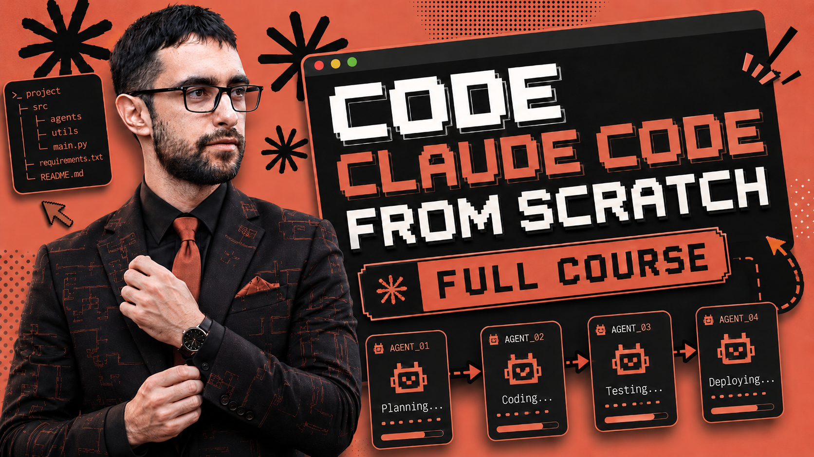

# Claude Code From Scratch

Build a Claude Code-style coding agent from scratch.

YouTube: https://youtu.be/VpetwCa7-eM

This course teaches the core engineering ideas behind coding agents: tool
calling, repo context, planning, safe file edits, shell commands, test loops,
session memory, CLI workflows, slash commands, and an interactive REPL.

The goal is not to clone every feature of Claude Code. The goal is to build a
clear portfolio project that proves you understand how coding agents work under
the hood.

## What You Will Build

By the end, you will have a small coding-agent framework with a transcript,
tool calling, repo mapping, plan mode, safe file edits, bash/test tools, search,
session resume, slash commands, and an interactive CLI.

## Course Lessons

- `01_intro.md` - first agent turn loop
- `02_repo_mapping.md` - repo context and project summaries
- `03_planning.md` - explicit plan mode
- `04_editing_patches.md` - safe file editing and diffs
- `05_permissions.md` - permission checks before risky actions
- `06_bash_commands.md` - shell command tool
- `07_tool_result_loop.md` - multi-step tool result loop
- `08_testing_loops.md` - running tests and responding to failures
- `09_todo_state.md` - todo state for multi-step work
- `10_search_tools.md` - glob and grep search tools
- `11_read_file_windows.md` - focused file reading
- `12_session_transcript.md` - structured session transcript
- `13_compact_context.md` - context compaction
- `14_end_to_end_build.md` - full runtime orchestration
- `15_cli_sessions.md` - CLI sessions and resume
- `16_slash_commands.md` - local slash commands
- `17_interactive_repl.md` - persistent interactive REPL

In our Skool community we are building this together as a 4 week structured project - https://www.skool.com/become-ai-researcher-2669/about
